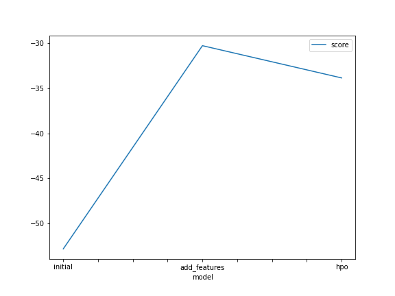
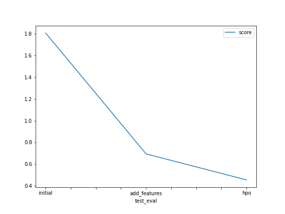

# Report: Predict Bike Sharing Demand with AutoGluon Solution
#### MOSTAFA OSAMA MOSTAFA ABDULRAZIC

## Initial Training
### What did you realize when you tried to submit your predictions? What changes were needed to the output of the predictor to submit your results?
I did not notice any unusual issue, because my predictions did not involve any negative values. If it did I presume an error would have occured
as Kaggle does not accept negative values. I would have needed to set those values to 0 at the time. Another thing I noticed is that the scores values
from the predictions were in negative (due to RMSE) but on Kaggle it was positive values, so that means they are most likely calculating score using a different metric.

### What was the top ranked model that performed?
Overall in all three models (initial, adding new features, hpo) the weighted ensemble model performed the best. That is due to it using weighted scores from many models.
If we are to ignore the weighted ensemble model, then Random Forest was best in the initial model, Cat Boost was best after adding features, and finally Extra Trees was best 
after HPO.

## Exploratory data analysis and feature creation
### What did the exploratory analysis find and how did you add additional features?
Exploratory analysis provided some useful statistics, for example it showed that there is no big difference between the min, mean and the max values which means no outliers.
I added additional features by adding separate hour, month, and day from the datetime feature.

### How much better did your model preform after adding additional features and why do you think that is?
It performed significantly better and that could be because additional features provide more complexity and allows the models to fight better patterns in the data.

## Hyper parameter tuning
### How much better did your model preform after trying different hyper parameters?
The models performed slightly better after the tuning. Although the training score was slightly worse, the predictions were overall better.
However, the hyperparameters I added were random and not so much. With more time and tuning the models can perform much better.

### If you were given more time with this dataset, where do you think you would spend more time?
In hyperparamter tuning, as this would be one of the main key points that could improve the prediction. Considering how this dataset is already cleaned and processed, hyperparamter tuning is the next best step.

### Create a table with the models you ran, the hyperparameters modified, and the kaggle score.
|model|CAT|GBM|XT|score|
|--|--|--|--|--|
|initial|default|default|default|1.80723|
|add_features|default|default|default|0.69373|
|hpo|learning_rate: 0.05, depth: 6|num_iterations: 150, learning_rate: 0.05|min_samples_leaf: 2, min_samples_split: 4|0.45390|

### Create a line plot showing the top model score for the three (or more) training runs during the project.

### Create a line plot showing the top kaggle score for the three (or more) prediction submissions during the project.

## Summary
As you can see in the two graphs, the initial model performed the worst in both the training score and the test prediction score. After adding new features the score improved in both.
However, after hyperparameter tuning the training score decreased slightly but it performed better on predictions. This shows that simply performing better on training does not necessarily mean
that the predictions will be better. The hyperparameter tuning carried out was very random and not very extensive, however, it still managed to give better predictions. With a more thorough and extensive hyperparameter tuning process the prediction score can be further improved.
